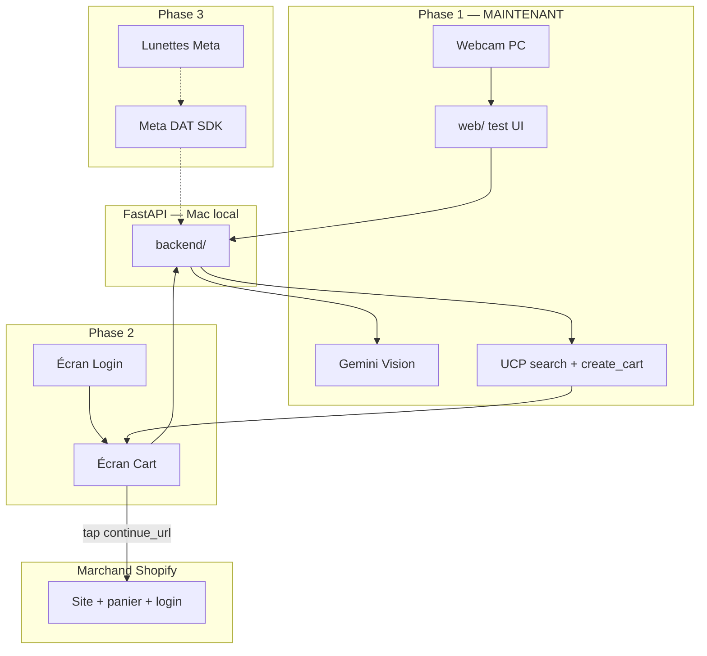

# Snap & Shop — Plan hackathon (LIVE)

> **Équipe :** 3 personnes · **3 Macs**  
> **Obligatoire :** Gemini Vision + **Shopify UCP** · Meta glasses en **Phase 3**  
> **App :** 2 écrans seulement — **Login** + **Cart** · pas d’app Shop

---

## Sommaire

1. [START HERE — ordre d’exécution](#start-here--ordre-dexécution)
2. [Vision produit](#vision-produit)
3. [Architecture & phases](#architecture--phases)
4. [Bootstrap repo (maintenant)](#bootstrap-repo-maintenant)
5. [Phase 1 — Gemini + UCP + webcam PC](#phase-1--gemini--ucp--webcam-pc)
6. [Phase 2 — App iOS (Login + Cart)](#phase-2--app-ios-login--cart)
7. [Phase 3 — Lunettes Meta](#phase-3--lunettes-meta)
8. [Contrat API](#contrat-api)
9. [Scaffolding monorepo](#scaffolding-monorepo)
10. [Équipe · Stack · Démo · Risques · Checklist](#équipe)

---

# START HERE — ordre d’exécution

> Le hackathon a commencé. Suivez cet ordre **strictement**.

| # | Action | Qui | Durée |
|---|--------|-----|-------|
| **0** | Créer repo GitHub + cloner + copier ce fichier | Tous | 10 min |
| **1** | Cursor : *« Bootstrap monorepo selon PLAN_HACKATHON.md »* | B | 30 min |
| **2** | `uvicorn` + `curl /health` + test UCP CLI | B | 20 min |
| **3** | **Phase 1** : webcam PC → Gemini → UCP → `create_cart` | B + C | 2–3 h |
| **4** | **Phase 2** : iOS Login + Cart + tap → merchant | A + B | 2–3 h |
| **5** | **Phase 3** : lunettes Meta (si le temps) | A | 2–3 h |
| **6** | Polish + pitch | C | 1 h |

**Règle d’or :** Phase 1 doit marcher **avant** de coder l’iOS. Phase 2 avant les lunettes.

---

# Vision produit

Tu vois un vêtement (webcam PC aujourd’hui, lunettes Meta demain). L’IA identifie l’article, **UCP** trouve le produit chez un marchand, crée un **panier**, et ton app affiche **un seul produit dans le cart**.

**Tap sur le produit** → Safari ouvre le **site du marchand** → l’utilisateur se **connecte chez le marchand** (si besoin) → le produit est **déjà dans son panier** → il paie.

| On fait | On ne fait pas |
|---------|----------------|
| UCP `search_catalog` + `create_cart` | App Shop / Shop Pay dans notre UI |
| Redirect `continue_url` vers le marchand | Sync compte marchand dans notre app |
| Login **dans notre app** (identité Snap & Shop) | UCP identity linking (OAuth par marchand) |
| 2 écrans iOS : Login + Cart | Albums, liste de 10 produits, web app |

**Flux UCP (important) :**

```
Photo → Gemini Vision → texte ("blue cotton t-shirt")
                      → UCP search_catalog
                      → UCP create_cart(variant_id)
                      → continue_url
                      → utilisateur tape → site marchand → login marchand → checkout
```

La vision génère la requête ; **UCP reste le moteur commerce**.

---

# Architecture & phases



## Décisions finales

| Décision | Choix |
|----------|-------|
| Backend | **FastAPI** local sur Mac (pas Vercel, pas Go) |
| Vision | **Gemini** multimodal |
| Commerce | **UCP** : `search_catalog` + **`create_cart`** |
| Redirect | **`continue_url`** → site marchand (pas Shop app) |
| App iOS | **2 écrans** : Login + Cart |
| Repo | **Monorepo** : `backend/` + `web/` + `ios/` |
| IDE | **Cursor** (code) + **Xcode** (Run iPhone) |
| Apple | Personal Team gratuit · Team ID **`8RXQA62R8G`** |
| Meta (Phase 3) | Bundle ID **`com.rayanmalki.mpchackathon`** |

---

# Bootstrap repo (maintenant)

## 1. Créer le repo

```bash
mkdir snap-shop && cd snap-shop
git init
# Copier PLAN_HACKATHON.md à la racine
```

## 2. Demander à Cursor

> *« Bootstrap le monorepo snap-shop selon PLAN_HACKATHON.md : backend FastAPI avec POST /scan (photo → Gemini → UCP search → create_cart → continue_url), web/ avec webcam, .gitignore, .env.example, README. »*

## 3. Lancer le backend

```bash
cd backend
python3 -m venv .venv && source .venv/bin/activate
pip install -r requirements.txt
cp ../.env.example .env   # remplir GEMINI_API_KEY
uvicorn main:app --reload --host 0.0.0.0 --port 8000
```

## 4. Tester sans UI

```bash
curl http://localhost:8000/health
curl -X POST http://localhost:8000/scan -F "file=@shirt.jpg"
# → product + continue_url
```

## Config Meta (déjà faite — Phase 3)

| Champ | Valeur |
|-------|--------|
| Team ID | `8RXQA62R8G` |
| Bundle ID | `com.rayanmalki.mpchackathon` |
| Universal link | `mpchackathon://` |
| Camera access | ON |

Xcode signing : retirer capabilities **Hotspot** et **Access Wi-Fi Information** (Personal Team).

---

# Phase 1 — Gemini + UCP + webcam PC

**Objectif :** photo chemise webcam → produit + lien panier marchand. **Pas d’iOS encore.**

## Pipeline backend

```
POST /scan
  1. Sauver image
  2. Gemini → { search_query, item_type, color, style }
  3. UCP search_catalog(query) → top product + variant_id + merchant URL
  4. UCP create_cart(variant_id, merchant) → continue_url
  5. Return { product, continue_url, status: "ready" }
```

## Qui fait quoi

| Personne | Tâches |
|----------|--------|
| **B** | `main.py`, `services/vision.py`, `services/ucp.py`, `services/pipeline.py` |
| **C** | Prompt Gemini, tester UCP CLI, `USE_MOCK_UCP` fallback |
| **A** | `web/index.html` : webcam + bouton capture + afficher produit + lien « Go to store » |

## UCP — commandes de test

```bash
# Recherche
ucp catalog search --set /query='blue cotton t-shirt' --set /context/address_country=CA

# Panier (remplacer variant_id et merchant)
ucp cart create --business https://MERCHANT.myshopify.com \
  --set /line_items/0/item/id='gid://shopify/ProductVariant/XXX' \
  --set /line_items/0/quantity=1 \
  --set /context/address_country=CA
```

## Critère de sortie Phase 1

- [ ] Webcam capture une chemise
- [ ] Gemini décrit l’article
- [ ] UCP retourne un produit
- [ ] `create_cart` retourne un **`continue_url`**
- [ ] Clic sur le lien → site marchand avec produit dans le panier

## Vitesse démo

| Action | Impact |
|--------|--------|
| FastAPI **local**, toujours allumé | ⭐⭐⭐ |
| `USE_MOCK_UCP=true` en secours | ⭐⭐⭐ |
| Pre-warm : 1 scan avant le pitch | ⭐⭐ |
| Skeleton UI pendant Gemini+UCP (3–8 s) | ⭐⭐ |

---

# Phase 2 — App iOS (Login + Cart)

**Objectif :** remplacer la webcam par l’app iPhone — **2 écrans seulement**.

## Écran 1 — Login

- Sign in with Apple **ou** email simple (Supabase / Clerk / mock login pour demo)
- Stocke un token / user_id pour le backend
- **Ne crée pas** de compte chez le marchand — c’est le rôle du site marchand au checkout

## Écran 2 — Cart

```
┌─────────────────────────┐
│  Your find              │
│  ┌─────┐  Blue Tee      │
│  │ img │  $29.99        │
│  └─────┘  merchant.com  │
│                         │
│  (loading si processing)│
└─────────────────────────┘
        ↓ tap anywhere
   Safari → continue_url
   → login marchand si besoin
   → produit déjà dans le panier
```

## SwiftUI — ouvrir le marchand

```swift
@Environment(\.openURL) private var openURL

Button("Go to store") {
    if let url = cart.continueURL {
        openURL(url)
    }
}
```

## Setup iOS

```bash
cp -R ~/Documents/GitHub/meta-wearables-dat-ios/samples/CameraAccess ios/
# OU nouveau projet SwiftUI si pas encore lunettes
open ios/CameraAccess/CameraAccess.xcodeproj
```

`APIConfig.baseURL` = `http://<IP-Mac>:8000` · `ipconfig getifaddr en0`

## Prompt Cursor — iOS

> *« App SwiftUI 2 écrans : LoginView + CartView. CartView appelle GET /cart/current ou POST /scan après capture. Affiche un produit (image, title, price, merchant). Tap → openURL(continue_url). Utilise PLAN_HACKATHON.md. »*

## Critère de sortie Phase 2

- [ ] Login fonctionne
- [ ] Cart affiche 1 produit (depuis backend)
- [ ] Tap → Safari → panier marchand avec le bon article

---

# Phase 3 — Lunettes Meta

**Uniquement si Phase 1 + 2 OK.**

| Tâche | Détail |
|-------|--------|
| Intégrer Meta DAT | Fork CameraAccess, `capturePhoto()` |
| Remplacer webcam | Photo lunettes → même `POST /scan` |
| Voix (stretch) | HFP → refine query → re-scan UCP |

Pas d’albums. Pas de liste multi-produits pour la démo. **Même écran Cart.**

Meta portal + Developer Mode déjà configurés (voir Bootstrap).

---

# Contrat API

**Base URL Mac :** `http://localhost:8000`  
**iPhone (Wi‑Fi) :** `http://<IP-Mac>:8000`

### `GET /health`

```json
{ "status": "ok" }
```

### `POST /scan`

Upload photo (webcam, fichier, ou lunettes).

`multipart/form-data` — champ `file` (JPEG/PNG)

**Réponse `200` :**

```json
{
  "status": "ready",
  "vision_summary": "Blue cotton crew neck t-shirt",
  "search_query": "blue cotton crew neck t-shirt men",
  "product": {
    "variant_id": "gid://shopify/ProductVariant/123",
    "title": "Classic Cotton Tee",
    "price_min": 2999,
    "price_max": 2999,
    "currency": "CAD",
    "image_url": "https://cdn.shopify.com/...",
    "merchant_domain": "store.example.com",
    "merchant_url": "https://store.example.com"
  },
  "continue_url": "https://store.example.com/cart/c/abc123",
  "cart_id": "gid://shopify/Cart/abc123"
}
```

`price_*` = **centimes**. Pendant traitement : `"status": "processing"` → client poll toutes les 1–2 s.

### `GET /cart/current`

Retourne le dernier panier/produit pour l’utilisateur connecté (header `Authorization: Bearer …`).

Même shape que la réponse `POST /scan` quand `status: ready`.

### `POST /auth/login` (stretch)

Email/password ou token Apple — minimal pour lier user → dernier cart.

---

# Scaffolding monorepo

```
snap-shop/
├── PLAN_HACKATHON.md
├── README.md
├── .gitignore
├── .env.example
│
├── backend/
│   ├── main.py
│   ├── config.py
│   ├── database.py
│   ├── requirements.txt
│   ├── models/schemas.py
│   └── services/
│       ├── vision.py      # Gemini
│       ├── ucp.py         # search_catalog + create_cart
│       └── pipeline.py    # scan flow
│
├── web/                   # Phase 1 — webcam test
│   ├── index.html
│   └── app.js
│
└── ios/                   # Phase 2+
    └── CameraAccess/      # copier sample Meta ici
        └── Views/
            ├── LoginView.swift
            └── CartView.swift
```

## `.gitignore`

```
.env
backend/.venv/
backend/data/
backend/uploads/
__pycache__/
ios/**/DerivedData/
ios/**/xcuserdata/
.DS_Store
```

## `.env.example`

```bash
HOST=0.0.0.0
PORT=8000
GEMINI_API_KEY=
UCP_AGENT_PROFILE_URL=https://your-domain.com/.well-known/ucp
USE_MOCK_UCP=true
DATABASE_URL=sqlite:///./data/snapshop.db
UPLOAD_DIR=./uploads
```

## `requirements.txt`

```
fastapi>=0.115.0
uvicorn[standard]>=0.32.0
python-multipart>=0.0.12
pydantic>=2.9.0
pydantic-settings>=2.6.0
httpx>=0.27.0
aiosqlite>=0.20.0
google-generativeai>=0.8.0
```

## Prompt Cursor — backend (canonical)

> *« Backend FastAPI selon PLAN_HACKATHON.md. POST /scan : BackgroundTask vision Gemini → UCP search_catalog → create_cart sur le merchant du top result. Retourne product + continue_url. USE_MOCK_UCP=true pour fake data. GET /cart/current. CORS *. »*

---

# Équipe

| Personne | Phase 1 | Phase 2 | Phase 3 |
|----------|---------|---------|---------|
| **A** | `web/` webcam UI | iOS Login + Cart | Meta SDK capture |
| **B** | FastAPI + UCP cart | Brancher iOS → API | Cache + perf |
| **C** | Prompts Gemini + tests UCP | Pitch + slides | Voix (stretch) |

**Git :** une personne merge · branches courtes · ouvrir **racine repo** dans Cursor.

**Mac serveur :** 1 Mac fait tourner `uvicorn` — les autres pointent vers son IP.

---

# MVP vs stretch

### MVP (démo juges)

- [ ] Webcam ou upload → Gemini → UCP search
- [ ] UCP **`create_cart`** → **`continue_url`**
- [ ] iOS : **Login + Cart** (2 écrans)
- [ ] Tap produit → site marchand → produit dans panier

### Stretch

- [ ] Lunettes Meta → même flow
- [ ] Voix pour affiner la recherche
- [ ] Email/SMS avec le lien `continue_url`

### Pas aujourd’hui

- App Shop / Shop Pay
- Sync compte marchand (UCP identity linking)
- Albums / multi-produits
- Checkout complet dans notre app

---

# Script démo (90 s)

1. **(10 s)** « On voit un vêtement — aujourd’hui webcam, demain lunettes Meta. »
2. **(15 s)** Capture → Gemini identifie l’article.
3. **(20 s)** « On interroge des marchands via le **Universal Commerce Protocol** de Shopify. »
4. **(15 s)** Le produit apparaît dans notre **Cart**.
5. **(20 s)** Tap → site du marchand → login → **produit déjà dans le panier**.
6. **(10 s)** « De regard à panier marchand en moins d’une minute. »

**Accroche :**

> *« Snap & Shop identifie ce que vous voyez, utilise UCP pour pré-remplir le panier chez le marchand, et vous envoie checkout-ready en un tap. »*

---

# Risques & mitigations

| Risque | Mitigation |
|--------|------------|
| UCP / Gemini lent | `USE_MOCK_UCP=true` + skeleton UI |
| `create_cart` échoue | Fallback `checkout_url` du catalog search |
| Wi‑Fi lieu bloque Mac↔iPhone | ngrok ou demo depuis web sur même Mac |
| Xcode 8 GB RAM | Teammate Mac plus puissant pour iOS |
| Pas login marchand en demo | Utiliser marchand + compte test pré-créé |
| Lunettes BLE | Phase 3 seulement ; webcam pour demo principale |

---

# Checklist — en cours de hackathon

## Maintenant (Phase 1)

- [ ] Repo créé + bootstrap Cursor
- [ ] `GEMINI_API_KEY` dans `.env`
- [ ] `ucp catalog search` OK en terminal
- [ ] `POST /scan` retourne `continue_url`
- [ ] Lien testé dans navigateur → panier marchand OK

## Phase 2

- [ ] iOS Login + Cart
- [ ] `APIConfig` = IP Mac
- [ ] Tap → Safari → panier marchand

## Phase 3 (si temps)

- [ ] Meta capture → `POST /scan`
- [ ] Demo live lunettes

## Avant pitch

- [ ] `uvicorn` chaud 10 min
- [ ] 1 scan pré-testé
- [ ] Pitch répété × 3

---

*Concentrez-vous sur : **scan → UCP cart → continue_url → tap → marchand**. Tout le reste est secondaire.*
